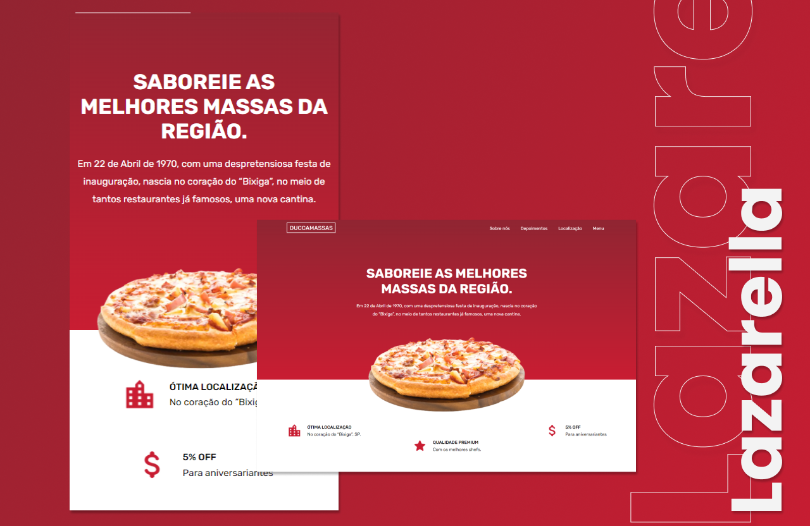

<div align="center">
<h1 align="center">Lazarella | Italian cuisine.<br> made with Next.JS. ⚛</h1>
</div>

<p align="center">
  <a href="#-Tecnologies">Tecnologies</a>&nbsp;&nbsp;&nbsp;|&nbsp;&nbsp;&nbsp;
  <a href="#-project">Project</a>&nbsp;&nbsp;&nbsp;|&nbsp;&nbsp;&nbsp;
  <a href="#memo-license">License</a>
</p>

<p align="center">
 
  
  
</p>

<p align="center">
    
</p>

<br>

<p align="center">
  
</p>

# 📄 Description:

### What is this project? 📝

- A responsive website for a restaurant, made with Next.JS, Sanity and SASS Modules.

# 🚀 Tecnologies:

This project was developed with the following technologies:

### Next.JS 📝

### react-icons 📝

### Sanity 📝

### SASS Modules 📝

How to run:

```bash

# Clone Repository

$ git clone

# Go to folder

$ cd my-repos

# Install Dependencies

$ npm install / yarn init

# Run Aplication

$ npm run dev / yarn dev


Go to http://localhost:3000/ to see the result.

```
# 🚧 Project:

### [Live project!]() 🚀

# 📝 License:

This project is under the MIT license. See the [LICENSE](LICENSE.md) for more information.

<hr>

<p align="center">Made by <a href="https://wwwjhonatan.oliveira.com/" target="_blank">Jhonatan Oliveira</a>.</p>